**Um pouco de magia no visual. Muita intenção na experiência.**

Pesquisa · Jornadas · Prototipagem · Usabilidade

[LinkedIn](https://www.linkedin.com/in/karinnadias/) · [Vamos trocar ideias?](https://github.com/karinadias)

---

## ✦ Por trás da interface

Oi, eu sou a **Karínná Dias**! Estou construindo minha trajetória em **UX/UI Design**, com curiosidade para entender pessoas e criatividade para explorar possibilidades.

Gosto de pensar no design como uma tradução: transformar dúvidas, necessidades e caminhos confusos em experiências que façam sentido para quem usa.

Por aqui, compartilho minha jornada de aprendizado — entre perguntas, rascunhos, protótipos e novas versões.

> Meu superpoder não é adivinhar o que as pessoas querem. É começar pela pergunta certa.

## ◌ Meu universo de UX

| Antes de desenhar… | Durante a exploração… | Depois do primeiro protótipo… |
| :--- | :--- | :--- |
| Entender pessoas e contexto | Organizar jornadas e fluxos | Ouvir feedback e testar hipóteses |
| Investigar necessidades | Explorar wireframes e interações | Revisitar decisões e iterar |
| Questionar suposições | Pensar em clareza e acessibilidade | Documentar o que foi aprendido |

## ⌁ No meu radar de estudos

**UX Research** — observar, perguntar e sintetizar descobertas.  
**Arquitetura da informação** — dar sentido à organização e à navegação.  
**Design de interação** — conectar intenção, ação e resposta.  
**Prototipagem no Figma** — tornar ideias exploráveis.  
**Usabilidade e acessibilidade** — projetar para diferentes pessoas e contextos.

## ✧ O que guia minhas escolhas

- **Pessoas antes de pixels.** A interface começa muito antes da tela.
- **Clareza também é beleza.** O visual precisa ajudar, não disputar atenção.
- **Acessibilidade desde o início.** Não como detalhe da última versão.
- **Curiosidade sem ego.** Uma boa descoberta pode mudar toda a ideia.

---

**Entre o caos das ideias e a clareza da experiência.**

Aberta a aprender, trocar referências e colaborar em projetos de UX.

✦ pesquisa com curiosidade · design com intenção · personalidade em marsala ✦

Banner adaptado da <a href="https://github.com/claudiosoaresdev/claudiosoaresdev/tree/feat/header-waves-particles">referência de Claudio Soares</a>.

